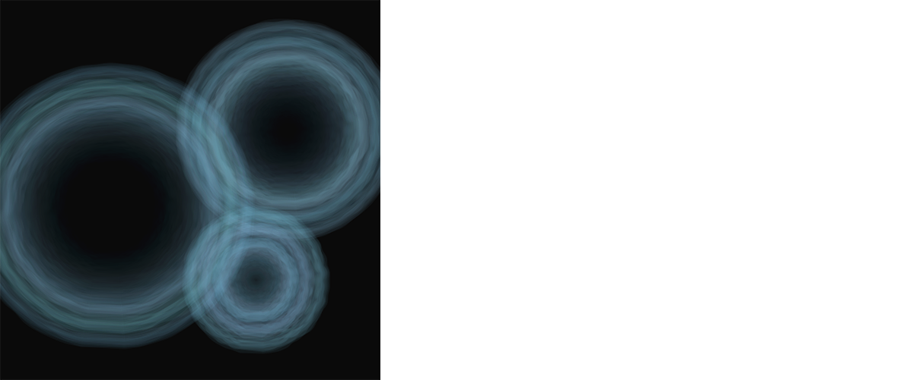

# Water Ripples

For this tutorial, we're going to learn how to create interactive water ripples that look like this:



## Step 1: Drawing a circle with points.

In order to create a ripple that has an uneven stroke, we need a to draw a circle with points that we can manipulate. As we learnt from last week, the x and y coordinates of the points along a circle are:

```js
float rad;          //the radius of the circle
float angle;        //the angle between the origin and the point

x = rad * sin(angle);
y = rad * cos(angle);
```
In order to make the numbers a little more manageable, we can convert `angle` from degrees into radians:

```js
x = rad * sin(radians(angle));      //this converts your input in degrees into radians.
y = rad * cos(radians(angle));
```

We can now use these x and y coordinates to create points at every degree:

```js
x1 = rad * sin(radians(0));
y1 = rad * cos(radians(0));
vertex(x1, y1);

x2 = rad * sin(radians(1));
y2 = rad * cos(radians(1));
vertex(x2, y2);

.
.
.

x360 = rad * sin(radians(359));
y360 = rad * cos(radians(359));
vertex(x359, y359);
```

By enclosing all these points within `beginShape()` and `endShape()` tags, we can draw a circle. We can also use a loop to go through every degree easily:

```js
beginShape();
 for (float angle = 0; angle < 360; angle += 1) {
   x = rad * sin(radians(angle));
   y = rad * cos(radians(angle));
   vertex(x, y);
}
endShape();
```

Let's see what we've got:

```js
float rad = 100;
float x, y;

void setup() {
  size(500, 500);
}

void draw() {
  translate(width/2, height/2);       //moving the circle to the middle.
  background(0);
  noFill();
  stroke(255);

  beginShape();
  for (float angle = 0; angle < 360; angle += 1) {
    x = rad * sin(radians(angle));
    y = rad * cos(radians(angle));
    vertex(x, y);
  }  
  endShape();
}
```

## Circular motion using trigonometry

```java
float xpos;
float ypos;
float diam;
float angle;

void setup() {
  size(400, 400);
  background(200);
  
  diam = 20;
  angle = 0;
}

void draw() {
  noStroke();
  fill(0);
  ellipse(xpos, ypos, 2, 2);
  
  xpos = width/2 + cos(angle) * 200;
  ypos = height/2 + sin(angle) * 200;
  angle += 0.03;
}
```

The value you add (`width/2` or `height/2`) will be the center point, the value you multiply (`200`) will be the diameter, and the amount of change (`angle`) is the speed of the circle. Now, you can think of these three values as something you can control.

```js
xpos = width/2 + cos(angle / 3) * width/2;
ypos = height/2 + sin(angle) * height/2;
angle += 0.03;
```


## Further learning
- [Processing trigonometry tutorial](https://processing.org/tutorials/trig/)
- [Lissajous curve](https://en.wikipedia.org/wiki/Lissajous_curve)
- Try graphing your motion first at http://desmos.com

